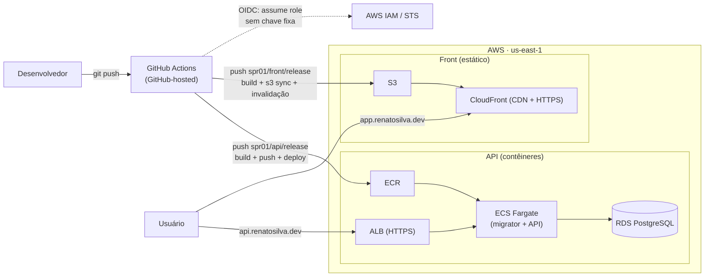

# Arquitetura Cloud & CI/CD — FleetExecutive

Sistema de gestão de frota executiva (multi-tenant) publicado na **AWS** com
**deploy 100% automatizado** e **sem chaves de acesso guardadas** (autenticação
por **OIDC**). Front e API sobem sozinhos a cada push nas branches de release.

## No ar

| Componente | URL |
|---|---|
| **Front** (Angular) | https://app.renatosilva.dev/fleetexecutive |
| **API** (.NET 9) | https://api.renatosilva.dev/health · `/api/v1/diagnostics/whoami` |

## Visão geral

## Componentes

| Camada | Serviço AWS | Papel |
|---|---|---|
| Front (CDN) | **S3 + CloudFront** | Serve o build do Angular com HTTPS e cache global |
| Registro de imagem | **ECR** | Guarda a imagem Docker da API |
| Execução | **ECS Fargate** | Roda os contêineres **sem gerenciar servidor** |
| Entrada da API | **ALB** | Load balancer HTTPS + health checks (`/health`) |
| Banco | **RDS PostgreSQL** | Dados (rede interna, só acessível pela task) |
| DNS / TLS | **Route 53 + ACM** | Domínio próprio e certificados gerenciados |
| Identidade | **IAM + OIDC** | GitHub Actions assume roles temporárias (sem segredo) |

## Pipeline CI/CD (GitHub Actions)

- **CI** (`_build-test.yml`, `ci-feature.yml`, `ci-pr-gate.yml`): a cada feature/PR,
  builda e roda **74 testes** (unitários + integração). Os testes de integração usam
  um **Postgres de serviço** (service container), com bootstrap de roles e migrations
  antes do `dotnet test`. PR verde faz **auto-merge**.
- **CD do Front** (`cd-front-release.yml`): build do Angular → `s3 sync` → invalidação do
  CloudFront.
- **CD da API** (`cd-api-release.yml`): build das imagens da API e do **migrator** →
  push no ECR → registra uma task com **dois contêineres** (migrator roda 1x e, via
  `dependsOn: SUCCESS`, a API só sobe depois das migrations) → cria/atualiza o service
  no ECS Fargate atrás do ALB → aguarda estabilizar → valida `/health`.

## Destaques técnicos

- **Zero segredos no repositório:** deploy autenticado por **OIDC** — o GitHub apresenta
  um token temporário que a AWS troca por credenciais que valem minutos. Sem
  `AWS_ACCESS_KEY` guardada.
- **Menor privilégio:** cada role de deploy é escopada por repositório **e branch**, e só
  às ações necessárias (ex.: o deploy do front só mexe no bucket + CloudFront).
- **Migrations como parte do deploy:** o migrator roda antes da API subir; se falhar, a
  API não sobe (deploy falha com segurança).
- **Infra como código (Terraform):** toda a plataforma (ECR, ECS, ALB, ACM, SGs, DNS,
  IAM) é versionada e reprodutível.

## Stack

.NET 9 (ASP.NET Core, EF Core, multi-tenant com Finbuckle) · Angular · PostgreSQL ·
Docker · Terraform · GitHub Actions · AWS (S3, CloudFront, ECR, ECS Fargate, ALB, RDS,
Route 53, ACM, IAM/OIDC, SSM).
